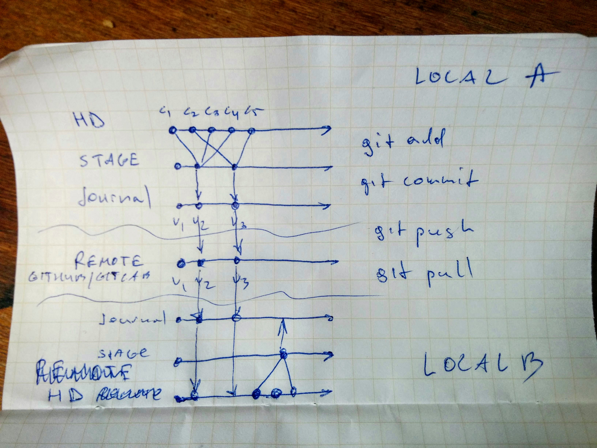

In this workshop we will cover the basics of version control with Git geared
towards critical computing practice in the humanities. Appropriate for
students, authors, librarians, journal editors, and book publishers the
workshop explains the how and they why of version control. Together, we will
learn about the Git repository model, journaling, branches, forks and much
more. No previous experience is required to participate. In preparation start
thinking not about code but about manuscripts, genetic criticism, philology,
the making of critical editions, copy-text, textual witness, *recensio*, and
stemmata.

Goals for today:

1. To understand the ideas behind version control.
2. To internalize the model behind Git.
3. To learn a set of basic commands and to make your first push.

Bonus: To file a pull request to an existing project.

## In Preparation

- Read the [Git Book](https://git-scm.com/book/en/v2), Chapters 1 & 2.
- Install Git, following the instructions in [Chapter
  1.5](https://git-scm.com/book/en/v2/Getting-Started-Installing-Git) of the
Git Book
- Complete the Hello World exercise from [Github
  Guides](https://guides.github.com/activities/hello-world/)

## Part 1: Theory (1.5 hr)

### What is Git?

- git is a friendly piece of software that monitors files in a **folder**[!]
- git is a journalling system
- git is a way to version control your documents
- git is a mode of collaboration

### Why Git?

- powerful
- universal
- enables collaboration
- critical mass
- journaling (lab notebook)
- publishing platform
- API for data feeds
- project management tools
- labor attribution

### Repository structure

### Concept review

files and folders  
.git  
staging area  
journal  
head  
commit  
repository  
branch  
fork  
pull request  
`git init`  
`git add`  
`git commit`  
`git push`  
`git pull`  
`git diff`  
`git status`  

## Part 2: Practice (1.5 hr)

Exercise 1: First Commit  
Exercise 2: Push and Pull  
Exercise 4: Resolving Conflicts  
Exercise 5: Pull Requests  

## Resources

- DH Notes [Git
  Cheatsheet](https://github.com/xpmethod/dhnotes/blob/master/cheatsheets/githum.md)
- [Git Book](http://git-scm.com/book)
